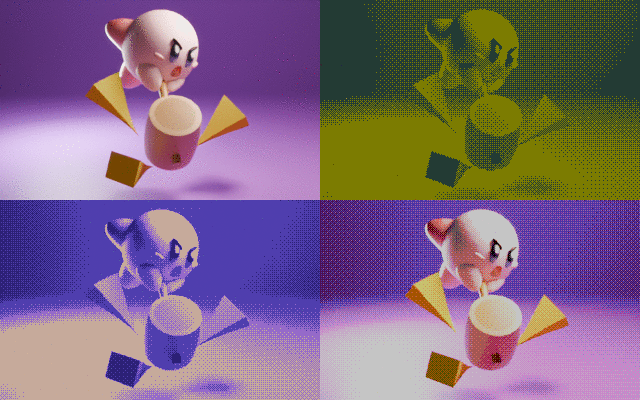
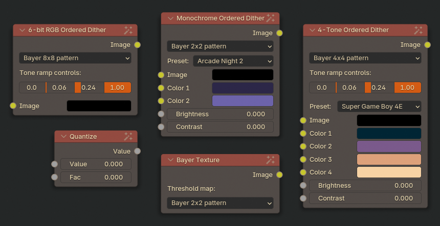
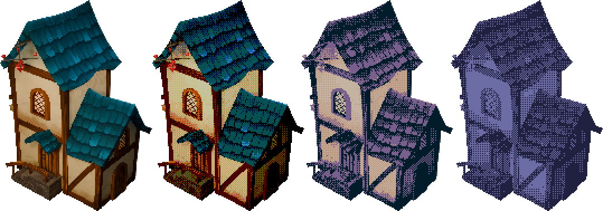
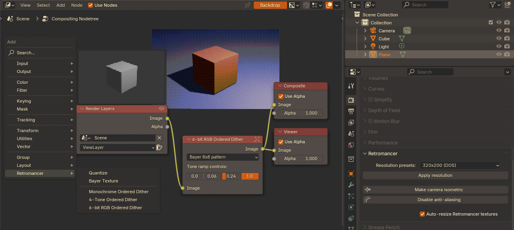

# 🪄 Retromancer - dithering compositing nodes for Blender ✨

    

> Kirby model by Ashley_koh ([source](https://sketchfab.com/3d-models/kirby-c28e636cf1fc41ec98a001a897f10721))

**Retromancer** is a Blender addon designed for artists who want to bend modern 3D renders into nostalgic, low-fidelity worlds. It brings custom compositing nodes using Bayer threshold maps, allowing you to quantize the render with the same structured dithering techniques used in classic handheld consoles and early computer graphics.
Whether you're after Game Boy tones, gritty monochrome dithering, or some indexed 90s-like palettes, Retromancer provides you with the nodes that do the magic required!

> [!NOTE]
>This addon is compatible with Blender 4.2.0 - 5.0, and works on Windows, Linux and macOS.

> [!TIP]
> If you're interested in more technical details about what's going on under the hood of Retromancer's custom nodes, check out [the documentation](docs/intro.md)! 

## 🪄 Installation ✨

1. Download source code .zip from the __Releases__ section of the release compatible with your Blender version
2. In Blender, go to __Edit > Preferences > Add-ons__
3. From __Add-ons Settings__ dropdown, click __Install from disk__
4. Navigate to downloaded `retromancer` archive and select it

## 🪄 Features ✨

* **3 custom dithering nodes** – **Monochrome**, **4-tone**, and **6-bit RGB** ordered dithering, each recreating actual graphics techniques used to render images in the past 

* **adjustable node parameters** – switch between 2x2, 4x4 and 8x8 Bayer treshold maps, modify tone ramps to precisely shape highlight, midtone, and shadow transitions, and tune your color palette with built-in pickers

* **color palette presets** – includes color schemes inspired by real Game Boy and handheld-era palettes

* **utility nodes** – **Bayer Texture** and **Quantize** nodes for those who wish to enhance their existing node setups

* **alpha channel support** – handles transparency for rendering anything like smoke, light or volumetrics, and works with transparent backgrounds

* **convenient properties panel** – quick access to rendering shortcuts and resolution presets sourced from classic gaming systems like the Game Boy, SNES, Sega consoles or the PlayStation 1

> Fantasy House model by Aditya Graphical ([source](https://sketchfab.com/3d-models/fantasy-house-cd86d0aa07c0491ea50c8f3dcb49a073))

## 🪄 How-to ✨

Retromancer nodes work in the compositor so you can setup your scene however you like and use your favourite shaders - your render will be dithered during compositing. Simply pass the __Image__ output from your __Render Layers__ node into one of the Ordered Dither nodes, available under __Add > Retromancer__ menu in the compositing workspace.

Retromancer also includes a dedicated panel in the __Render Properties__ with convenient shortcuts for common retro-workflow tasks: switching the camera to isometric mode, disabling render anti-aliasing and render resolution presets taken from actual retro gaming platforms.

