# Dithering implementation in compositing

This chapter explains how Retromancer implements ordered dithering inside Blender’s compositor, including Bayer matrix generation, tone decomposition and RGB quantization.

## Background

Dithering is a computer graphics technique used to simplify an image’s color palette while tricking the human eye into perceiving a wider range of colors. 
Essentially, dithering applies intentional noise: instead of quantizing an image into large areas of flat color, it creates the illusion of smooth gradients by using pixel patterns that alternate between neighboring colors at varying densities.
There are many algorithms designed to perform dithering, but one of the most recognized and widely used in digital graphics is Bayer ordered dithering.

Bayer ordered dithering works by applying a threshold map $M$ (also called a Bayer matrix) to the pixels of an image. For each pixel, its normalized intensity is compared to the corresponding value in the matrix repeated across the image in a tiled pattern. If the pixel’s intensity is greater than the threshold, it is mapped to the higher color. Otherwise, it is mapped to the lower color. This creates the characteristic cross-hatched pattern typical for Bayer dithering.

Commonly used Bayer threshold maps are 2x2, 4x4, and 8x8 matrices (though any power-of-two size will work for the matrix side length). Smaller matrices produce coarser images, while larger matrices create smoother-looking approximations. The Bayer pattern is easy to tile, can be recursively expanded, and is both computationally and memory efficient. 

```math
M_{2} = \frac{1}{4} \begin{bmatrix}0&2\\3&1\end{bmatrix}
```

```math
M_{4} = \frac{1}{16}
\begin{bmatrix}
0 & 8 & 2 & 10 \\
12 & 4 & 14 & 6 \\
3 & 11 & 1 & 9 \\
15 & 7 & 13 & 5 
\end{bmatrix}
```

```math
M_{8} = \frac{1}{64}
\begin{bmatrix}
0 & 32 & 8 & 40 & 2 & 34 & 10 & 42 \\
48 & 16 & 56 & 24 & 50 & 18 & 58 & 26 \\
12 & 44 & 4 & 36 & 14 & 46 & 6 & 38 \\
60 & 28 & 52 & 20 & 62 & 30 & 54 & 22 \\
3 & 35 & 11 & 43 & 1 & 33 & 9 & 41 \\
51 & 19 & 59 & 27 & 49 & 17 & 57 & 25 \\
15 & 47 & 7 & 39 & 13 & 45 & 5 & 37 \\
63 & 31 & 55 & 23 & 61 & 29 & 53 & 21
\end{bmatrix}
```

## Blender implementation

### Bayer textures

<p align="center">
    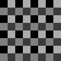 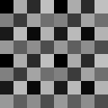 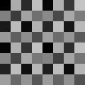 
</p>

Retromancer programatically generates Bayer treshold maps textures from precalculated values.
Then they're tiled across the entire render area based on the current render resolution. The final texture dimensions are updated in the background whenever the render resolution gets changed by the user via a Blender app handler function. 

This approach worked better than just bundling pre-generated 2x2, 4x4 and 8x8 pixel textures images with the addon and tiling them in compositor, as the latter introduced unwanted artifacts whenever the texture had to be tiled across image which dimensions weren’t a multiple of the matrix size. 

### 2-tone dithering

<p align="center">
    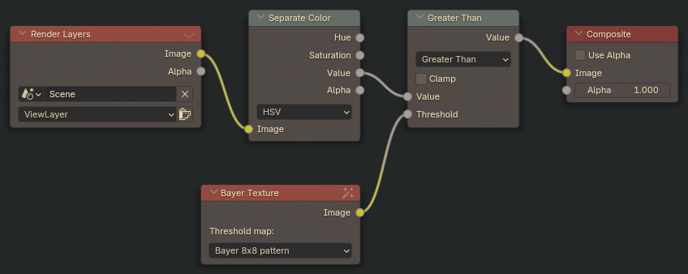
</p>

This node setup implements two-tone gradient dithering and is essentially core of the Monochromatic Ordered Dither node in Retromancer! It works by isolating the Value channel of the rendered image (this can also be HSL Luminosity, or grayscale-converted image), then comparing each pixel’s value against a Bayer matrix texture used as a threshold for Greater Than math node. Below is a preview of the image at each stage of this setup: 

<p align="center">
    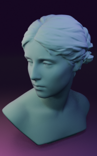 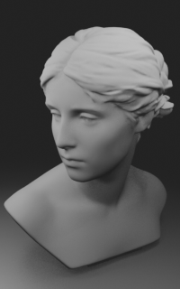 
</p>

### 4-tone dithering

<p align="center">
    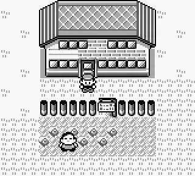
</p>


One of my core visual inspirations for Retromancer comes from early Game Boy titles, especially the Pokémon series. The original Game Boy display hardware was limited to 4 grayscale tones (later with the Game Boy Color this was expanded to 32,000 colors total, but you could still pick some of the predefined selectable 4-color palettes). As primitive as the hardware may seem now, the intricate techniques used to make games look richer than they actually were - while still fitting into incredibly small ROM sizes - have always fascinated me. Capturing this aesthetic was an obvious choice while working on Retromancer nodes!

To achieve smooth 4-tone dithered gradient, image needs to be decomposed into partial gradients, each dithered independently. Each of this partial gradient covers a range between two adjacent colors in the palette, so assuming classic Game Boy grayscale pallete, these ranges are:

* Black -> dark gray (shadows)
* Dark gray -> light gray (midtones)
* Light gray -> White (highlights)

<p align="center">
    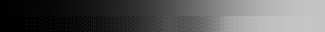
</p>

Compositing node setup that handles single range looks like this (here for midtones specifically):

<p align="center">
    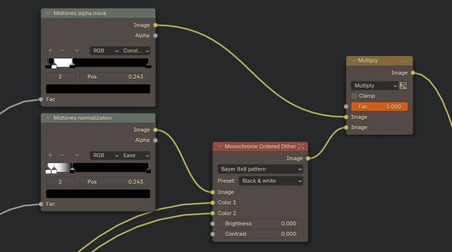
</p>

This node setup is built around two _Color Ramp_ nodes:

* The _alpha mask_ node determines which parts of the image belong to each tonal range. This way we can strip the render out of the pixel data that doesn't belong to the tone and won't alter other parts of the render when all tones are added together later.

* The _normalization_ node performs contrast stretching, mapping the darkest values to pure black and the brightest to pure white to ensure the image color values span the full tonal range.

Both nodes use the raw rendered image as the _Fac_ input. The positions of the _Color Ramp_ handles - kept identical across all tone ranges - control the width of each tonal band in the final dithered image. Adjusting these handles makes it possible to fine-tune how the gradients appear in the dithered result.

The _Monochrome Ordered Dither_ node used here is essentially the same setup described in the previous section, but replaced with a single node. Here it includes an additional feature: it accepts two input colors (in case of midtones, those are dark and light gray from Game Boy palette). Black and white dithered output can be used as an alpha mask for a _Mix_ node, so these two colors can be mapped directly onto the dither pattern, allowing the node to produce colorized result.

Here are outputs from, in order: alpha mask node, normalization node and dithered partial image of the render.

<p align="center">
     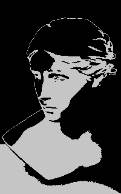 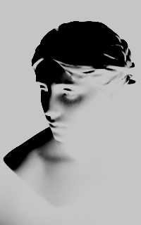 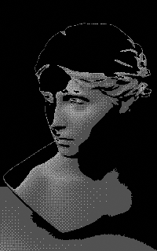
</p>

The full dithered result is created by adding all the tone partial images on top of one another. This brings us to the final node setup shown here:

<p align="center">
    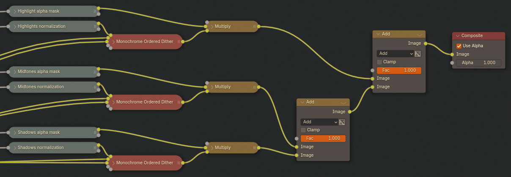
</p>

And the final render looks like this! 

<p align="center">
    
</p>

### RGB dithering

The same approach used for grayscale dithering can also be applied to color images. Instead of working on the Value channel, the Red, Green and Blue channels are processed instead.

To achieve better results, the _4-tone Ordered Dither_ node is used (again, replacing the full 4-tone setup from the previous section) - while a 2-tone dither will work as well, it produces very coarse images as a final renders. Each channel is passed through the dither node, and the results are then combined back together.

<p align ="center">
    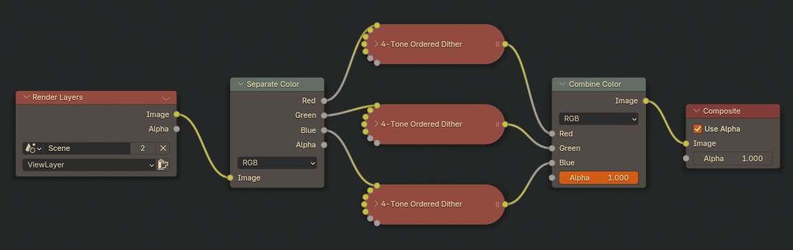
</p>

The output image is quantized to a 6-bit RGB color space: each channel is reduced to 4 discrete tones, giving up to $4^{3}=64$ distinct colors. Selecting different Choosing different Bayer matrices for dithering will influence the level of quantization as well. Below, you can see the results using 2x2, 4x4, and 8x8 matrices:

<p align="center">
    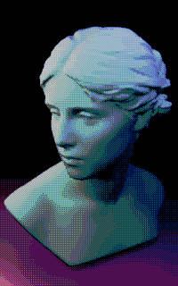  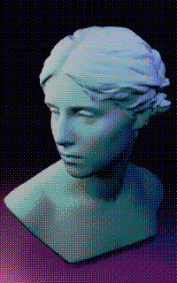  
</p>