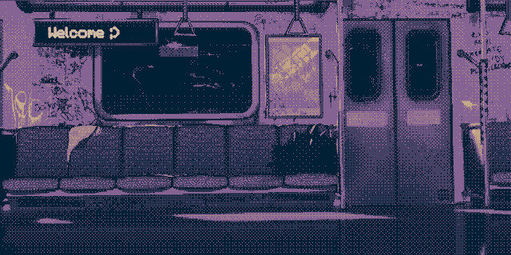

# Retromancer documentation

> [Train](https://www.artstation.com/artwork/qQgJPa) dithered render by [DragouMare](https://dragoumare.carrd.co)

Retromancer came to life because I wanted to use Blender for rendering retro aesthetic art for once, instead of just scripting it at work! I'm keen on nostalgic gaming visuals and I found that most of the techniques people used at the time were not really historically accurate and looked a bit off to me. I wanted my renders to look just like the old DOS or Game Boy games I played as a kid and thought - surely it’s possible to set this up in Blender, right?

So I begun reading about dithering techniques and how to apply it using shaders at first, then deciding that maybe compositing node setup could be better for my renders (Eevee includes Separate RGB shaders, but Cycles which I'm more used to does not), and then I fell down the rabbit hole of trying to script it all (obviously). It was quite a ride of both poring over Blender API documentation and deducing it from its source code, experimenting with the node setups and gathering knowledge about image quantization from multiple sources and now I'm willing to share what I think might be useful (and also to not forget)! 

While this could all stay as node group library assets, I'm not a big fan of how they're supposed to be shared and installed. I thought it would be cool side project to get accustomed with writing Blender addons, therefore it's all implemented entirely using Python. 

## Table of contents

* [Repository overview](repository.md)
* [Dithering implementation in compositing](dithering.md)
* [Retromancer nodes description](nodes.md)

