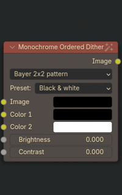
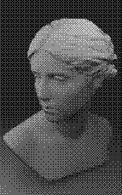
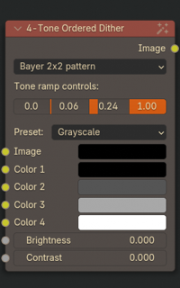
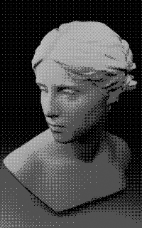
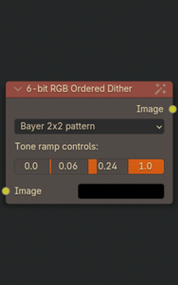
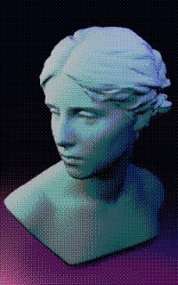
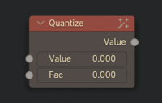
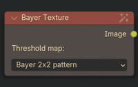

# Retromancer nodes

This chapter describes each node from Retromancer category.

## Dithering nodes

## Monochrome Ordered Dither

 

2-bit ordered dither using Bayer treshold maps. 
Output can be colorized using 2 manual color pickers or by selecting a preset from a dropdown. 
The effect can be adjusted using _Brightness_ and _Contrast_ settings.

### Color palette presets

| | |
|-|-|
|  Arcade Evening |  Arcade Night 1 |
|  Arcade Night 2 |  Arcade Sky Blue |
|  Arcade Sunrise 1 |  Arcade Sunrise 2 |
|  Arcade Sunset 1 |  Arcade Sunset 2 |
|  Black & white |  Game Boy Color Inverted |
|  Game Boy Color Orange |  Game Boy Color Pastel Mix |
|  Game Boy DMG |  Game Boy Light |
|  Game Boy Pocket |  Nokia 3310 |
|  Nokia 3310 backlight |  Super Game Boy 1A |
|  Super Game Boy 2B |  Super Game Boy 3A |
|  Super Game Boy 3C |  Super Game Boy 3F |
|  Super Game Boy 4C |  Super Game Boy 4E |
|  Super Game Boy 4F | |

## 4-tone Ordered Dither

 

4-tone ordered dither using Bayer treshold maps. 
Output can be colorized using 4 manual color pickers or by selecting a preset from a dropdown. 
Allows for fine-tuning shadows, midtones and highlights levels by adjusting _Tone ramp controls_.
The effect can be further adjusted using _Brightness_ and _Contrast_ settings. 

### Color palette presets

| | |
|-|-|
|  Arcade Evening |  Arcade Night 1 |
|  Arcade Night 2 |  Arcade Sky Blue |
|  Arcade Sunrise 1 |  Arcade Sunrise 2 |
|  Arcade Sunset 1 |  Arcade Sunset 2 |
|  Grayscale |  Game Boy DMG |
|  Game Boy Light |  Game Boy Pocket |
|  Game Boy Color Orange |  Game Boy Color Inverted |
|  Game Boy Color Pastel Mix |  Super Game Boy 1A |
|  Super Game Boy 2B |  Super Game Boy 3A |
|  Super Game Boy 3C |  Super Game Boy 3F |
|  Super Game Boy 4C |  Super Game Boy 4E |
|  Super Game Boy 4F | |

## 6-bit RGB Ordered Dither

 

RGB ordered dither using Bayer treshold maps.
Color palette is reduced to 64 colors. 
Allows for fine-tuning shadows, midtones and highlights levels by adjusting _Tone ramp controls_.

## Utility 

### Quantize

Quantizes an image's Value to reduced number. This works similarly to the Blender's original _Posterize_ node.

### Bayer Texture

Outputs Bayer texture image. This texture is seamlessly tiled and has current render resolution's dimensions.
Bayer matrix size can be picked from dropdown menu (2x2, 4x4 and 8x8 variants). 